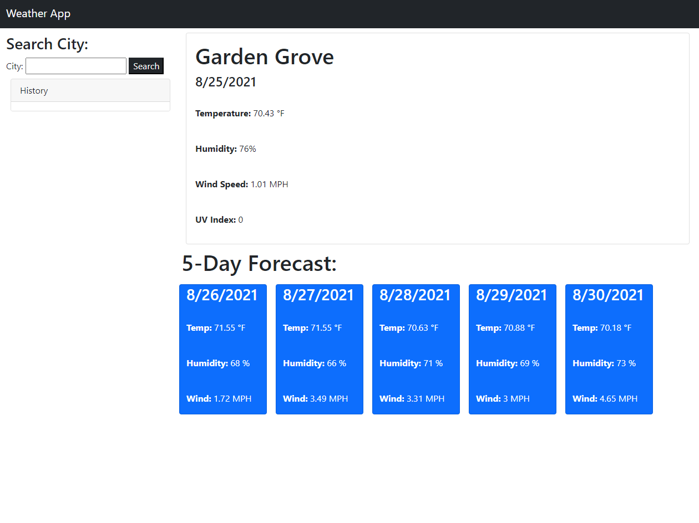

# Weather App

This is a weather app for any city the user searched up.
It will include the name of the city of searched for on top of the page, current date, temperature, humidity, wind speed and UV index.

On the bottom of the page is a 5-Day Forecast for the searched city. 
All of the days include temp, humidity and wind.

Link: https://polyca123.github.io/weather/

